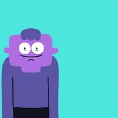
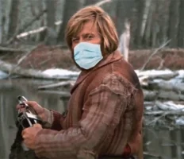
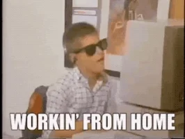

# CLONE VACCINATE

_Esta practica se trata de clonar el Diseño de una Landing Page, con el objetivo de poner en practica los conocimientos de CSS, la finalidad es poder generar el diseño mas cercano posible al diseño proporcionado_

## Descripcion 🧑‍⚖️

* _[Link de DISEÑO ](https://github.com/LaunchX-InnovaccionVirtual/FrontEnd-Mision/blob/main/03%20-%20CSS/practica/landingVacunaci%C3%B3n.png)._

* _La vacunacion es muy importante ya que en estos momentos se esta poniendo la tercera dosis, debemos recordar esta informacion._

### Practicas 📋

*    
* Un poco de mercadotecnia para llegar al sitio. 
* Maquetacion del sitio HTML. 
* Estilos con CSS, lo mas cercano posible, pueden usarse otras imagenes, iconos o colores, pero lo mas cercano posible. 
* Bonus de estilos CSS
* Bonus de Despliegue --> Montar la pagina en linea con dominio Gratuito

## Construido con 🛠️

_Para estas practicas se utilizaron los conocimientos vistos en el curso FrontEnd-Mision_

## Wiki 📖

Puedes encontrar mucho más de cómo utilizar este proyecto en nuestra [Wiki](https://github.com/LaunchX-InnovaccionVirtual/FrontEnd-Mision)

## Autores ✒️

_En esta ocacion el proyecto fue realizado de forma independiente_

* **Gualberto Montiel Diaz** - *Trabajo Inicial* - [gumodi35](https://github.com/gumodi35)

## Expresiones de Gratitud 🎁

* Esta practica sirve para conocer el proceso de desarrollo y los requerimientos para realizar una aplicacion web 📢
* Invita una cerveza 🍺 o un café ☕ a alguien del equipo.
* Gracias por fomentar el aprendizaje de tecnologias web 🤓.

---
⌨️ con ❤️ por [gumodi35](https://github.com/gumodi35) 😊